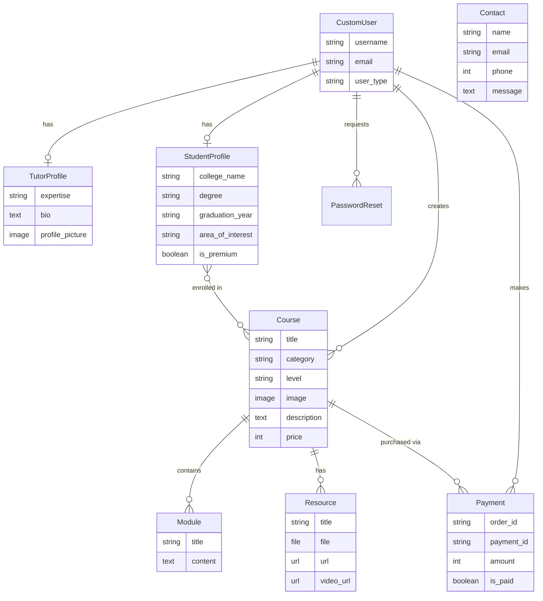

<p align="center">
  <h1 align="center">🎓 SkillEnhancer</h1>
  <p align="center">
    <strong>A full-stack online learning platform built with Django</strong>
  </p>
  <p align="center">
    <em>Connecting tutors and students through interactive courses, modules, and resources — with integrated payment processing via Razorpay.</em>
  </p>
  <p align="center">
    <a href="#features">Features</a> •
    <a href="#tech-stack">Tech Stack</a> •
    <a href="#getting-started">Getting Started</a> •
    <a href="#project-structure">Project Structure</a> •
    <a href="#usage">Usage</a> •
    <a href="#contributing">Contributing</a>
  </p>
</p>

---

## 📋 Overview

**SkillEnhancer** is a web-based e-learning platform that enables tutors to create and manage courses while students can browse, purchase, and enroll in them. The platform supports two distinct user roles — **Tutors** and **Students** — each with dedicated dashboards, authentication flows, and feature sets.

Key highlights:
- 🔐 Role-based authentication (Tutor / Student) with separate registration, login, and password-reset flows
- 📚 Full course management (create, edit, delete) with modules and multi-format resources
- 💳 Razorpay payment integration for course purchases and premium subscriptions
- 🔍 Advanced course filtering & search with pagination
- 📧 Email notifications via SMTP (contact form confirmations, password reset links)
- 🎨 Responsive Bootstrap-based UI with custom styling

---

## ✨ Features

### For Students
| Feature | Description |
|---|---|
| **Registration & Login** | Dedicated student sign-up with college, degree, graduation year, and area of interest fields |
| **Browse & Filter Courses** | Search by title, filter by category, level, and price range with paginated results |
| **Course Enrollment** | Purchase and enroll in courses via Razorpay payment gateway |
| **Premium Plan** | Upgrade to a premium membership for access to exclusive content |
| **Student Dashboard** | View enrolled courses and profile information |
| **Password Reset** | Email-based password reset with time-limited (10 min) secure links |

### For Tutors
| Feature | Description |
|---|---|
| **Registration & Login** | Tutor sign-up with expertise area, bio, and profile picture upload |
| **Course Management** | Create, edit, and delete courses with title, category, level, image, description, and price |
| **Module Management** | Add and edit modules within courses |
| **Resource Management** | Upload PDFs, videos, or attach URLs / video links to courses |
| **Tutor Dashboard** | Overview of all created courses with quick-access management links |
| **Search & Manage** | Search through own courses, update or delete them from dedicated pages |

### General
- 📬 **Contact Form** — with email confirmation sent to the user
- 🏠 **Landing Page** — hero banner, fun-facts section, featured courses, and "Become an Instructor" CTA
- 👤 **Django Admin** — full admin panel with custom user admin for managing all platform data

---

## 🛠 Tech Stack

| Layer | Technology |
|---|---|
| **Backend** | Python 3, Django 5.1 |
| **Database** | SQLite (default, easily swappable) |
| **Frontend** | HTML5, CSS3, Bootstrap 5, JavaScript |
| **CSS Tooling** | Tailwind CSS (via `django-tailwind`), custom stylesheets |
| **Icons** | Boxicons, Font Awesome |
| **Payment Gateway** | Razorpay (test mode) |
| **Email** | Django SMTP backend (Gmail) |
| **Filtering** | django-filters |
| **Dev Tools** | django-browser-reload, django-environ |

---

## 📁 Project Structure

```
SkillEnhancerr/
├── Project/
│   └── SKillEnhancer/              # Django project root
│       ├── SKillEnhancer/          # Project configuration
│       │   ├── settings.py         # Django settings (DB, email, Razorpay, etc.)
│       │   ├── urls.py             # Root URL configuration
│       │   ├── views.py            # Project-level views
│       │   ├── wsgi.py             # WSGI entry point
│       │   ├── asgi.py             # ASGI entry point
│       │   └── .env                # Environment variables (Razorpay keys)
│       │
│       ├── app/                    # Main application
│       │   ├── models.py           # Data models (CustomUser, Course, Module, etc.)
│       │   ├── views.py            # All view functions (~1060 lines)
│       │   ├── urls.py             # App URL routes
│       │   ├── forms.py            # Django forms (Contact, User, Course, etc.)
│       │   ├── filters.py          # django-filter CourseFilter
│       │   ├── admin.py            # Admin site registration
│       │   └── migrations/         # Database migrations
│       │
│       ├── templates/              # HTML templates (42 files)
│       │   ├── base.html           # Main landing page layout
│       │   ├── tutor_base.html     # Tutor layout
│       │   ├── student_base.html   # Student layout
│       │   ├── tutor_dashboard.html
│       │   ├── student_dashboard.html
│       │   ├── *_login.html        # Login pages (tutor / student)
│       │   ├── *_register.html     # Registration pages
│       │   ├── add_course.html     # Course creation form
│       │   ├── add_module.html     # Module creation form
│       │   ├── add_resource.html   # Resource upload form
│       │   ├── Explore_courses.html
│       │   ├── course_detail.html
│       │   ├── payment.html        # Razorpay payment page
│       │   ├── premium_plan.html   # Premium plan info
│       │   └── ...                 # Edit, delete, password reset pages
│       │
│       ├── static/                 # Static assets
│       │   ├── style1.css          # Main stylesheet
│       │   ├── style.css           # Additional styles
│       │   ├── color-1.css         # Color theme
│       │   ├── main.js             # Custom JavaScript
│       │   ├── bootstrap.min.css   # Bootstrap 5
│       │   ├── bootstrap.bundle.min.js
│       │   ├── font-awesome.css
│       │   ├── courses/            # Course category images
│       │   ├── instructor/         # Instructor avatar images
│       │   ├── review/             # Review/testimonial images
│       │   └── webfonts/           # Font files
│       │
│       ├── media/                  # User-uploaded media
│       │   ├── course_images/      # Course thumbnails
│       │   ├── profile_pics/       # Tutor profile pictures
│       │   ├── resources/          # Uploaded PDFs & videos
│       │   └── tutor_profiles/     # Tutor profile images
│       │
│       ├── theme/                  # Tailwind CSS theme app
│       ├── db.sqlite3              # SQLite database
│       └── manage.py               # Django management script
│
├── SkillEnhancer/                  # VS Code config & gitignore
│   └── .gitignore
│
└── README.md
```

---

## 🗃 Data Models



---

## 🚀 Getting Started

### Prerequisites

- **Python 3.10+**
- **pip** (Python package manager)
- **Node.js & npm** (required for Tailwind CSS compilation)
- **Git**

### Installation

1. **Clone the repository**

   ```bash
   git clone https://github.com/NEH-PATEL0810/SkillEnhancerr.git
   cd SkillEnhancerr/Project/SKillEnhancer
   ```

2. **Create and activate a virtual environment**

   ```bash
   # Windows
   python -m venv my_venv
   my_venv\Scripts\activate

   # macOS / Linux
   python3 -m venv my_venv
   source my_venv/bin/activate
   ```

3. **Install Python dependencies**

   ```bash
   pip install django django-tailwind django-browser-reload django-filter django-environ razorpay Pillow
   ```

4. **Configure environment variables**

   Update `SKillEnhancer/.env` with your credentials:

   ```env
   RAZORPAY_KEY_ID=your_razorpay_key_id
   RAZORPAY_KEY_SECRET=your_razorpay_key_secret
   ```

   Also update email credentials in `SKillEnhancer/settings.py`:

   ```python
   EMAIL_HOST_USER = "your_email@gmail.com"
   EMAIL_HOST_PASSWORD = "your_app_password"
   ```

5. **Run database migrations**

   ```bash
   python manage.py makemigrations
   python manage.py migrate
   ```

6. **Create a superuser** (for admin panel access)

   ```bash
   python manage.py createsuperuser
   ```

7. **Install Tailwind dependencies** (optional, for CSS development)

   ```bash
   python manage.py tailwind install
   python manage.py tailwind start
   ```

8. **Start the development server**

   ```bash
   python manage.py runserver
   ```

9. **Open in browser**

   Navigate to [http://127.0.0.1:8000/](http://127.0.0.1:8000/)

---

## 📖 Usage

### User Flows

#### Student Journey
```
Register → Login → Browse/Filter Courses → View Course Details
    → Purchase Course (Razorpay) → Access Enrolled Courses
    → Upgrade to Premium Plan
```

#### Tutor Journey
```
Register → Login → Create Course → Add Modules → Add Resources
    → Manage Courses (Edit/Delete) → View Dashboard Analytics
```

### Key URLs

| URL | Description |
|---|---|
| `/` | Landing page (home) |
| `/admin/` | Django admin panel |
| `/Student_login/` | Student login |
| `/tutor_login/` | Tutor login |
| `/register/` | Student registration |
| `/tutor_register/` | Tutor registration |
| `/Explore_Course/` | Public course explorer |
| `/Student_Explore_Course/` | Student course explorer (authenticated) |
| `/student_dashboard/` | Student dashboard |
| `/tutor_dashboard/` | Tutor dashboard |
| `/add-course/` | Create a new course (tutor) |
| `/Premium_plan/` | Premium plan info |
| `/contact/` | Contact form |
| `/payment/` | Payment page |

---

## ⚙️ Configuration

### Razorpay Setup

The platform uses **Razorpay** in test mode for payment processing. To use your own Razorpay account:

1. Create a [Razorpay](https://razorpay.com/) account
2. Obtain your **Key ID** and **Key Secret** from the Razorpay Dashboard
3. Update the values in `SKillEnhancer/settings.py`:
   ```python
   RAZORPAY_KEY_ID = "your_key_id"
   RAZORPAY_KEY_SECRET = "your_key_secret"
   ```

### Email Setup

Email notifications use Gmail SMTP. To configure:

1. Enable [2-Step Verification](https://myaccount.google.com/security) on your Google account
2. Generate an [App Password](https://myaccount.google.com/apppasswords)
3. Update `settings.py`:
   ```python
   EMAIL_HOST_USER = "your_email@gmail.com"
   EMAIL_HOST_PASSWORD = "your_16_char_app_password"
   ```

---


## 👤 Author

**Neh Patel** — [@NEH-PATEL0810](https://github.com/NEH-PATEL0810)

---

<p align="center">
  Made with ❤️ using Django
</p>
